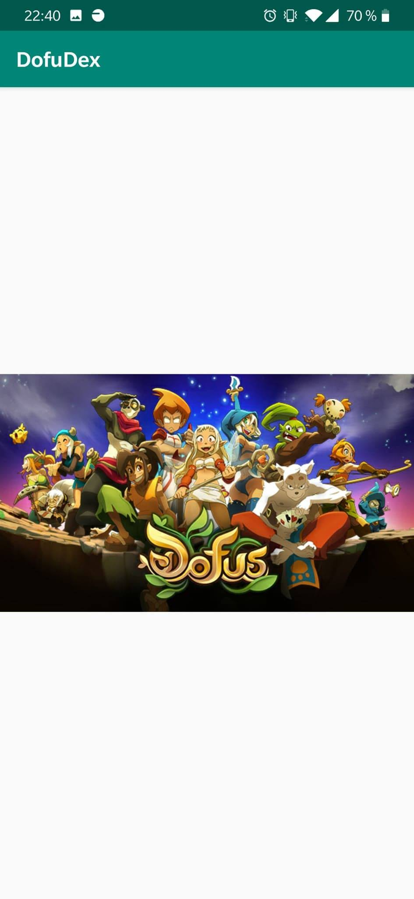

# Application DofuDex


-Laboudi hakim

## Présentation

Projet de developement d'une application mobile visant à nous familiariser avec Adroid studio, savoir développer sa propre application mobile et maîtrise de Git.


## Prérequis


- Installation d'Android Studio
- Creation d'un compte GITHub
- Mon projet de l'année 2019 (3A)

````
https://github.com/hlaboudi/DofDof
````

## Consignes respectées : 
-Fragment
-Appel WebService à une API Rest.
-Design
-Architecture MVC
-Git


- Fonctions supplémentaires :

- barre de recherhe 
- Affichage du détail d'un item de la liste
- Menu Navigation / Bottom Bar
- Liste de Pets dofus
- Détail Pets / descriptif
- Splash ecran de lancement.
- creation d'une branche (GitFlow)
- Build de l'apk (dans le fichier app)

## Fonctionnalités: 

### Premier écran 

- Splash (2 sec ) arrivant sur la liste des familiers
  


### Ecran deux : la liste complete des Pets : 

- Affichage de la liste des familier dofus et leurs numeros d'identifiants. 


### Ecran deux : la liste des Pets de niveau 1 et de niveau 60 :
fragment : 


### Ecran deux : recherche : 
recherche d'un Pet.


### Ecran du détail du familier : 

- Affiche les différentes informations sur le familier
    - Le nom
    - Le descriptif
    - Son apparance. 


