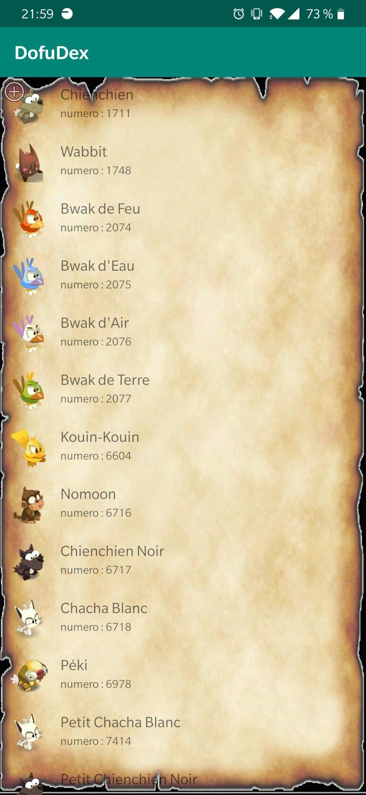
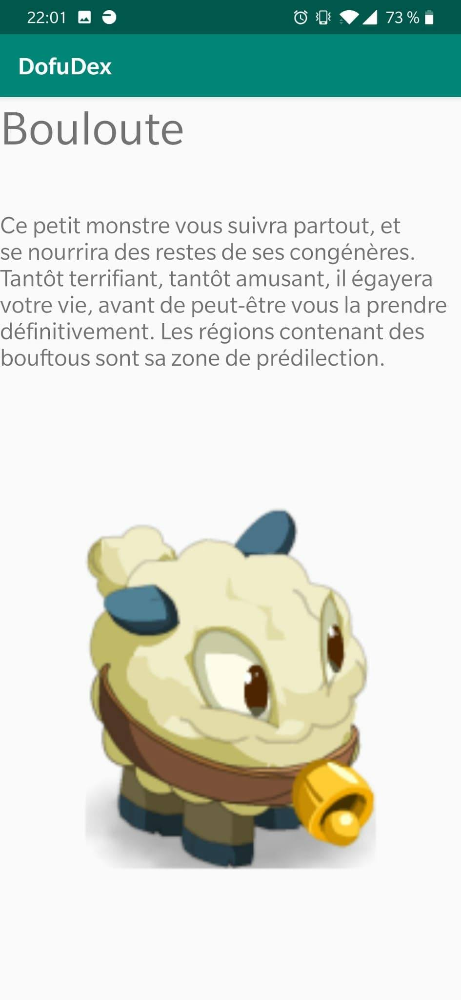

# Application DofuDex


-Laboudi hakim

## Présentation

Projet de developement d'une application mobile visant à nous familiariser avec Adroid studio, GitHub et travailler notre java. 

## Prérequis


- Installation d'Android Studio
- Creation d'un compte GITHub

````
https://github.com/hlaboudi/DofDof
````

## Consignes respectées : 

- Ecrans : 2 activités minimum
- Appels REST
- Affichage d'une liste dans un RecyclerView
- Affichage du détail d'un item de la liste


- Fonctions supplémentaires :
   - Splash ecran de lancement.
   - creation d'une branche (GitFlow)
   - Architecture MVC

## Fonctionnalités: 

### Premier écran 

- Splash arrivant sur l'accueil puis redirection sur le deuxieme ecran. 
  


### Ecran deux : la liste: 

- Affichage de la liste des familier dofus et leurs numeros d'identifiants. 

  


### Ecran du détail du familier : 


- Affiche les différentes informations sur le familier
    - Le nom
    - Le descriptif
    - Son apparance. 
  


